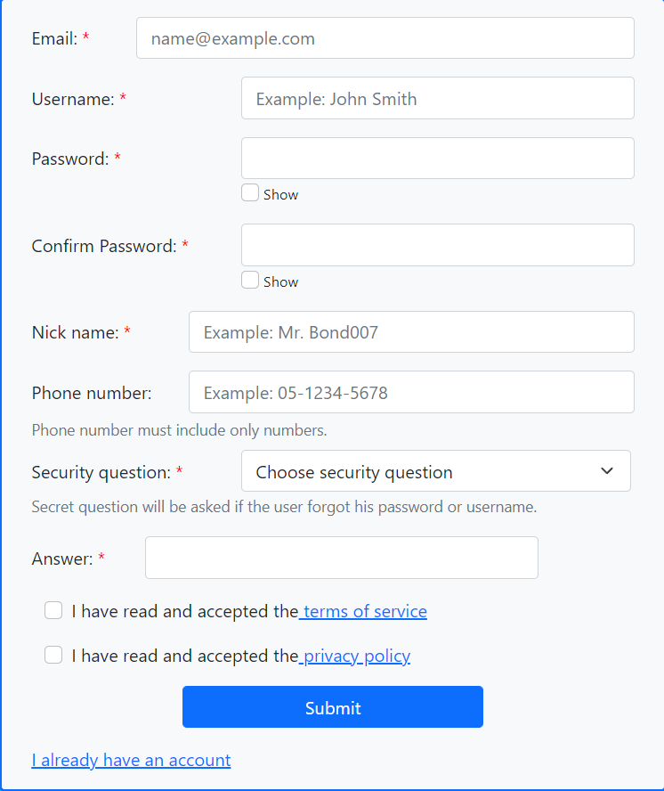
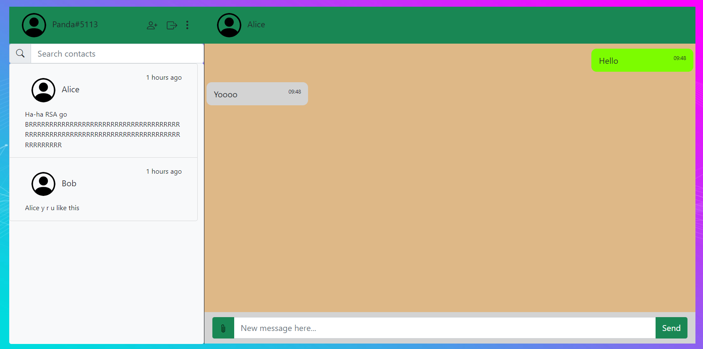

# Whatsapp-like web-client

Submitters:

Yuval Uner, ID: 322558842, Github: OddPanda.\
Nadav Elgrabli, ID: 316082791, Github: ZycleXx.

To run the project, use "npm start".

### `dependencies`
1. React
2. React-Bootstrap
3. React-router / React-router-dom

# Main Components

## Mandatory components

### `Log-in form`
The home screen of the app when a user is not logged in.

Verifies the validity of the username on log-in and directs them to the main chat app,
or allows them to go to the sign-up form or the forgot password form.

Also lets the user know if they have an error when trying to log in, allows switching between
logging in via username or password, enabling or disabling 
the "remember me" feature, and toggling "show password".

### `Sign-up form`
The form for a new user to sign up.

Allows for inputting all of the vital information, as well as some non-vital information.\
Performs basic checks while the user inputs their information.

### `Main app`
The main part of the project. Allows for conversations between users.

The main app supports sending text, video, image and audio between users.\
It also allows for a user to change their profile picture, description and nickname, as well as 
add contacts to their contacts list, all via the buttons' toolbar to the right of their nickname.

The right side of the screen (the conversation itself) will appear once a contact is chosen.

## Additional, non-mandatory components

### Code Splitting

This section has moved here: [https://facebook.github.io/create-react-app/docs/code-splitting](https://facebook.github.io/create-react-app/docs/code-splitting)

### Analyzing the Bundle Size

This section has moved here: [https://facebook.github.io/create-react-app/docs/analyzing-the-bundle-size](https://facebook.github.io/create-react-app/docs/analyzing-the-bundle-size)

### Making a Progressive Web App

This section has moved here: [https://facebook.github.io/create-react-app/docs/making-a-progressive-web-app](https://facebook.github.io/create-react-app/docs/making-a-progressive-web-app)

### Advanced Configuration

This section has moved here: [https://facebook.github.io/create-react-app/docs/advanced-configuration](https://facebook.github.io/create-react-app/docs/advanced-configuration)

### Deployment

This section has moved here: [https://facebook.github.io/create-react-app/docs/deployment](https://facebook.github.io/create-react-app/docs/deployment)

### `npm run build` fails to minify

This section has moved here: [https://facebook.github.io/create-react-app/docs/troubleshooting#npm-run-build-fails-to-minify](https://facebook.github.io/create-react-app/docs/troubleshooting#npm-run-build-fails-to-minify)
